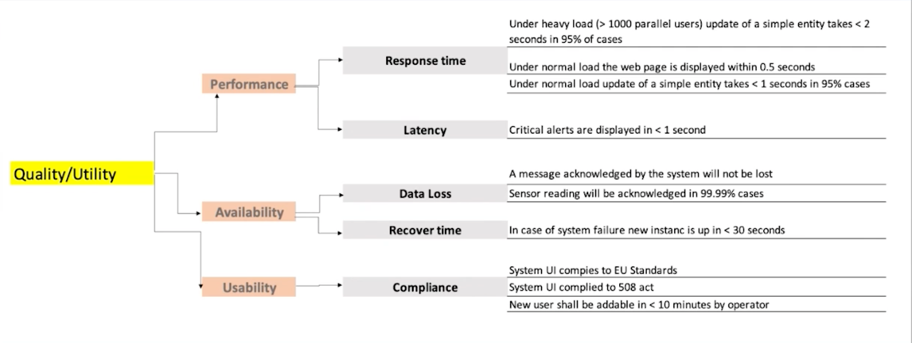
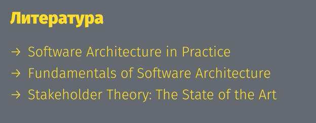

**Требования**

Делятся на
- функциональные (пр: клиент должен получить нотификацию после регистрации) -> что должен видеть пользователь/что должно происходить
Описывают, ЧТО должно происходить
- нефункциональные (пр: насколько быстро должны приходить нотификации).
    - Non-function requirements
    - Quality attributes
    - Architecture attribues
Описывают, КАК должно происходить
- ограничения
    - Система олжна соблюдать законы РФ
    - Бюджет
    
**Источники требований:**
- Доменная область
- Регуляторы(регуляция законом и тд)
- Среда (например, все приложения заказчика запускаются в cloud)
- Стейкхолдеры, т.е. люди, заинтересованные в проекте:
    - Спонсоры 
    - Заказчики
    - Команда разработки
    - Конечные пользователи
    - Конкуренты
    
**Классификация стейкхолдеров:**
- По влиянию/интересу
- По роли в проекте

**Матрица RACI:**
R - responsible, эти люди непосредственно делают работу
A - accountable, несут ответственность(руками не производят работу)
C - consulted, люди, хорошо разбирающиеся в доменной области
I - informed, люди, которых нужно информировать(пр - спонсоры)

**Приоритизация требований:**
Utility Tree:

Приоритизируем требования от важных для архитектуры/пользователей к менее важным

Полезная литература:

    