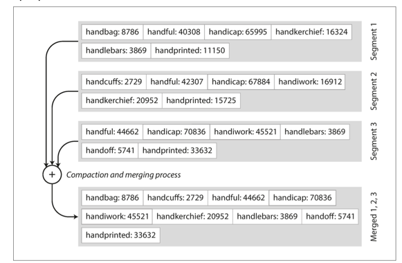

SSL tables(Sorted String Table) - последовательность пар ключ-значение, отсортированных по ключу.
SS-таблица разделена на сегменты, внутри каждого сегмента ключи уникальны.
Алгоритм объединения сегментов очень похож на алгоритм merge-sort. Пример объединения сегментов:

