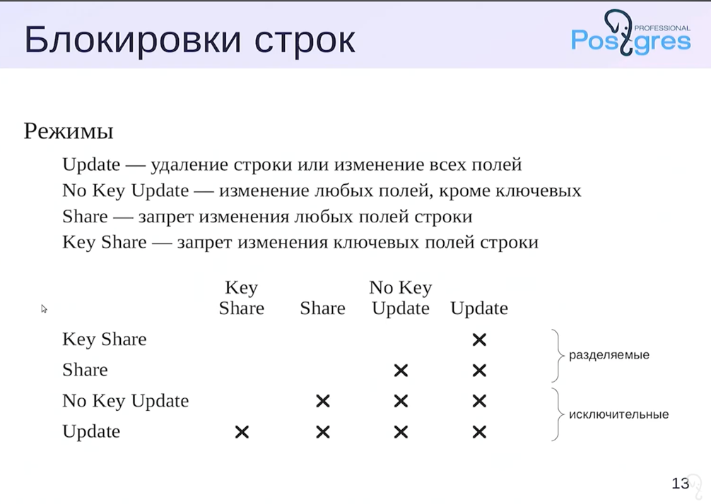

**Задача блокировок** — упорядочить конкурентный доступ к разделяемым ресурсам

**Конкурентный** = одновременный/в режиме разделения времени(логически разные процессы обращаются к каким-то ресурсам)

Перед обращением к данным процесс захватывает блокировку
После обращения — освобождает(обычно это конец транзакции)

Несовместимые блокировки приводят к очередям

### Блокировки объектов

Множество объектов очень разнообразно, но по каждому из типов объекта блокировки можно посмотреть в представлении pg_locks https://postgrespro.ru/docs/postgresql/12/view-pg-locks

#### Номера транзакции

К блокировкам транзакции в pg_locks относятся 2 типа ресурсов: 
- virtualxid(виртуальный номер транзакции), выдается транзакции до тех пор, пока она только читает и ничего не меняет. 
  Пока транзакция ничего не меняет, нам можно не учитывать ее при создании снимка данных => снимки данных становятся легче и с ними  проще работать 
- transactionid(номер транзакции)

Для таких блокировок есть 2 режима: 
- исключительный
- разделяемый

**_Транзакция всегда удерживает исключительную блокировку собственного номера!_**

Если у нее есть только виртуальный номер, то она удерживает блокировку только виртуального номера, а если есть еще и настоящий, то тогда обе
Это очень удобный способ дожидаться завершения какой-либо транзакции. Если у транзакции уже есть блокировка, то мы не сможем получить блокировку по ее номеру и поток просто заснет до тех пор,
пока транзакция не завершится и блокировка не освободится.

### Блокировки отношений

К отношениям в pg относятся таблицы, индексы, последовательности, mv и тп
В pg_locks блокировки отношений имеют тип relation. 
У таких блокировок насчитывается 8 различных режимов:
- **Access Share**              SELECT
- **Row Share**                 SELECT FOR UPDATE/SHARE
- **Row Exclusive**             UPDATE/DELETE/INSERT
- Share Update Exclusive        VACUUM/ALTER TABLE/CREATE INDEX CONCURRENTLY

 _верхние допускают параллельное изменение данных в таблице_

- **Share**                     CREATE INDEX
- **Share Row Exclusive**       CREATE TRIGGER/ALTER TABLE
- **Exclusive**                 REFRESH MAT.VIEW CONCURRENTLY
- **Access Exclusive**          DROP/TRUNCATE/VACUUM FULL/LOCK TABLE/ALTER TABLE/REFRESH MAT.VIEW

Пример: блокировка Access Share является самой слабой и допускает работу со всеми другими блокировками кроме Access Exclusive.
То есть, если к таблице делается SELECT запрос, то очевидно, что такую таблицу нельзя удалить, поэтому получить Access Exclusive блокировку не получится.

### Блокировки строк

