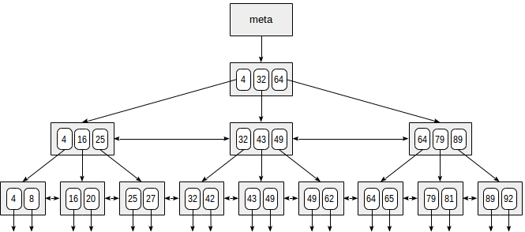
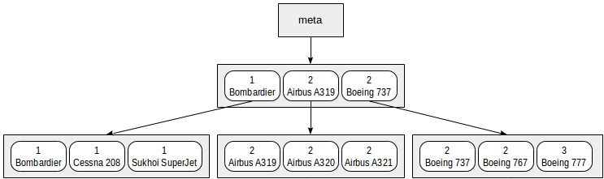

# Индексы в PostgreSQL

Индексы(методы доступа)

## Сканирование по битовой карте
Индексное сканирование хорошо работает, когда речь идет всего о нескольких значениях. Однако при увеличении выборки возрастают шансы, что придется возвращаться к одной и той же табличной странице несколько раз. Поэтому в таком случае оптимизатор переключается на сканирование по битовой карте (bitmap scan):

postgres=# explain (costs off) select * from t where a <= 100;
QUERY PLAN
------------------------------------
Bitmap Heap Scan on t
Recheck Cond: (a <= 100)
->  Bitmap Index Scan on t_a_idx
Index Cond: (a <= 100)
(4 rows)

## Последовательное сканирование

Индексы работают тем лучше, чем выше селективность условия, то есть чем меньше строк ему удовлетворяет. При увеличении выборки возрастают и накладные расходы на чтение страниц индекса.
Если индекс построен неправильно или объем данных, который попадет под индекс, слишком велик, оптимизатор предпочтет использовать Seq Scan.

## Покрывающие индексы

Все индексы в PostgreSQL являются вторичными, что значит, что каждый индекс хранится 
вне области основных данных таблицы, которая в терминологии PostgreSQL называется кучей таблицы.
Это значит, что при обычном сканировании индекса для извлечения каждой строки необходимо прочитать данные и из индекса, и из кучи.

Более того, тогда как элементы индекса, соответствующие заданному условию WHERE, обычно находятся в индексе рядом, строки таблицы могут располагаться в куче произвольным образом.
Таким образом, обращение к куче при поиске по индексу влечёт множество операций произвольного чтения кучи.

### Когда будут использоваться только индексы(без похода в кучу)

Тип индекса должен поддерживать сканирование только индекса. Индексы-B-деревья поддерживают его всегда. Индексы GiST и SP-GiST могут поддерживать его с одними классами операторов и не поддерживать с другими.
Запрос должен обращаться только к столбцам, сохранённым в индексе. Например, если в таблице построен индекс по столбцам x и y, и в ней есть также столбец z, такие запросы будут использовать сканирование только индекса:

SELECT x, y FROM tab WHERE x = 'key';
SELECT x FROM tab WHERE x = 'key' AND y < 42;

А эти запросы не будут:

SELECT x, z FROM tab WHERE x = 'key';
SELECT x FROM tab WHERE x = 'key' AND z < 42;

Если два этих фундаментальных ограничения выполняются, то все данные, требуемые для выполнения запроса, содержатся в индексе, так что сканирование только по индексу физически возможно.

!!! Но в PostgreSQL существует и ещё одно требование для сканирования таблицы: необходимо убедиться, что все возвращаемые строки «видны» в снимке MVCC запроса.
PostgreSQL отслеживает для каждой страницы в куче таблицы, являются ли все строки в этой странице достаточно старыми, чтобы их видели все текущие и будущие транзакции. Это отражается в битах в карте видимости таблицы.
Процедура сканирования только индекса, найдя потенциально подходящую запись в индексе, проверяет бит в карте видимости для соответствующей страницы в куче. Если он установлен, значит эта строка видна, и данные могут быть возвращены сразу. В большинстве ситуаций карта видимости просто всё время находится в памяти и для работы с ней
требуется много меньше операций физического ввода/вывода.

Чтобы эффективно использовать возможность сканирования только индекса, вы можете создавать покрывающие индексы. 
Такие индексы специально предназначены для включения столбцов, которые требуются в определённых часто выполняемых запросах.
Так как в запросах обычно нужно получить не только столбцы, по которым выполняется поиск, PostgreSQL позволяет создать индекс, в котором некоторые столбцы будут просто «дополнительной нагрузкой», но не войдут в поисковый ключ. Это реализуется предложением INCLUDE, в котором перечисляются дополнительные столбцы. Например, если часто выполняется запрос вида

SELECT y FROM tab WHERE x = 'key';
при традиционном подходе его можно ускорить, создав индекс только по x. Однако такой индекс:

CREATE INDEX tab_x_y ON tab(x) INCLUDE (y);

Практический смысл включать дополнительные столбцы в индекс есть только тогда, когда таблица меняется достаточно медленно, и при сканировании только индекса не приходится обращаться к куче. 

При анализе запроса покрывающий индекс выглядит как Index Only Scan(используется только индекс, нет обращения в кучу)

## Составные индексы

Индексы, состоящие из нескольких столбцов, называются составными или многоколоночными. При наличии индекса

Оптимизатор с больше вероятностью предпочтет индекс CREATE INDEX ON t(a,b); , в котором участвуют оба столбца, в запросе:
select * from t where a <= 100 and b = 'a';

Многоколоночный индекс может использоваться и для ускорения выборки по условию на часть полей — начиная с первого:
select * from t where a <= 100;

Как правило, если на первое поле не наложено условие, индекс использоваться не будет.

 ## Частичный индекс

Иногда возникает необходимость проиндексировать только часть строк таблицы. Обычно это связано с сильной неравномерностью распределения: редкое значение имеет смысл искать по индексу, но частое проще найти полным сканированием таблицы.
Частичный индекс - это индекс содержащий в себе условие, по которому строки будет в него попадать.
Например, CREATE INDEX ON t(c) WHERE c;

## Типы индексов

В PostgreSQL существует 6 типов индексов(методов доступа) к данным, в этот список не включен Seq Sqan - последовательное сканирование.

Типы:
- btree
- hash
- gist
- gin
- spgist
- brin

### Hash индекс

Хеш-функция в PostgreSQL всегда возвращает число типа int, то есть значение входит в диапазон 2^32, что равно примерно 4млрд значений.
Число корзин изначально равно двум и увеличивается динамически, подстраиваясь под объем данных.

Postgres Pro поддерживает реализацию хеш-индексов, которые хранятся на диске и могут полностью восстанавливаться после сбоя. Хеш-индекс может быть построен по данным любого типа, в том числе типа, для которого не определён линейный порядок. Хеш-индексы хранят только хеш-значение индексируемых данных, поэтому размер индексируемого столбца данных неограничен.

**Важно!!!! Хеш-индексы могут строиться только по одному столбцу и не позволяют проверять уникальность**

Хеш-индексы поддерживают только оператор =, поэтому для предложений WHERE, в которых фигурируют проверки интервалов, хеш-индексы будут бесполезны

Хеш-индексы предназначены в первую очередь для нагрузки с большим количеством операций SELECT и UPDATE, которые выполняют сканирование с проверкой равенства для больших таблиц

### Btree индекс

Индекс btree, он же B-дерево, пригоден для данных, которые можно отсортировать. Иными словами, для типа данных должны быть определены операторы «больше», «больше или равно», «меньше», «меньше или равно» и «равно».

B-деревья обладают несколькими важными свойствами:

- Они сбалансированы, то есть любую листовую страницу отделяет от корня одно и то же число внутренних страниц. Поэтому поиск любого значения занимает одинаковое время.
- Они сильно ветвисты, то есть каждая страница (как правило, 8 КБ) содержит сразу много (сотни) TID-ов. За счет этого глубина B-деревьев получается небольшой; на практике до 4–5 для очень больших таблиц.
- Данные в индексе упорядочены по неубыванию (как между страницами, так и внутри каждой страницы), а страницы одного уровня связаны между собой двунаправленным списком. Поэтому получить упорядоченный набор данных мы можем, просто проходя по списку в одну или в другую сторону, не возвращаясь каждый раз к корню.

#### Сортировка
При создании индекса можно явно указывать порядок сортировки. Например, индекс по дальности полета можно было создать и так:

`create index on aircrafts(range desc);`

При этом слева в дереве оказались бы большие значения, а справа — меньшие.
Сортировка в индексе нужна при использовании многоколончатых индексов для корректной работы запросов, использующих сортировку

**!!! Важно!!! В случае B-дерева этот порядок имеет огромное значение: данные внутри страниц будут отсортированы сначала по первому полю, затем по второму и так далее.**

#### Неопределенные значения
Метод доступа btree индексирует неопределенные значения и поддерживает поиск по условиям is null и is not null.
