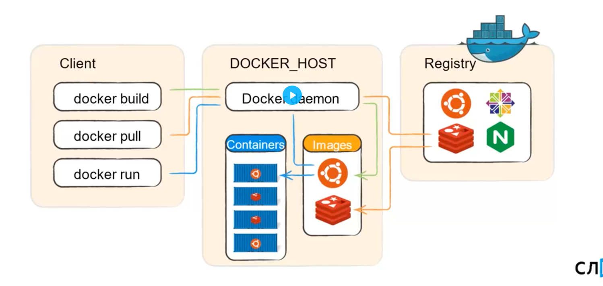

Docker - ПО для автоматизации развертывания и управления приложениями в средах с поддержкой контейнеризации

Компоненты docker:

Docker daemon - серверная часть, работает на сервере, где запускается приложение. Скачивает образы и запускает в них
контейнеры, создавая сеть между ними. Собирает логи контейнеров/создает новые образы

CLI - клиентская утилита, посредством API взаимодействует с docker-сервером

- Image - образ для контейнеров, слепок. Каждый image имеет hash, имя и тег, имеет слоеную структуру

- Registry - хранилище образов(можно сделать свое, можно использовать общее)

- Container - самостоятельная единица, изолированная от других контейнеров, запускается на основе какого-то образа.
1 процесс = 1 контейнер(рекомендация)

  
docker run - скачивает образ + запускает из него контейнер
docker container ls/docker ps - информация о работающих контейнерах

docker ps -a - показать ВСЕ контейнеры

* docker inspect <container_name> - информация о контейнере
* docker build . -t work:0.1 - создание image (-t название образа с тегом)
* docker exec -it <container_name> bash - попасть в консоль определенного контейнера

