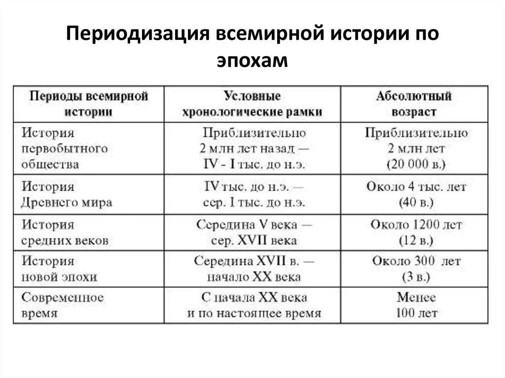

- **Что отличает первобытного человека от животного мира? Какие факты о жизни и деятельности 
   человека нужно получить, чтобы убедиться, что это уже человек?**
  
Разные школы античной философии выделяли мыслительные функции, дух как критерии отличия человека от животных.
Ряд исследователей выделяли в кач-ве критерия, выделяющих человека среди других животных, умение изготавливать орудия труда.
В этом случае умение изготавливать орудие рассматривается как основной маркер сугубо зоологической процедуры.
Поиск смыслов/души/захоронения

- **Какие виды первобытного человека известны?**

Создателем культур нижнего палеолита был человек типа питекантропа или синантропа, среднего палеолита — неандерталец, верхнего палеолита — кроманьонец. Около 40-30 тыс. лет назад произошел скачок в физическом строении формирующегося человека: появляется человек современного типа — Homo sapiens.

- Австралопитек
- Пятикантроп
- Неандерталец(мясоед, очень холодно)
- Кроманьонец – человек каменного века

https://ecodelo.org/2555-4_vidy_i_podvidy_cheloveka_smenyayushchie_drug_druga-chelovek_i_biosfera

_Австралопитек умелый_ появился в Африке на около 5 млн. лет тому назад. Это был житель тропической саванны. 
Он выдержал конкуренцию с другими австралопитеками, разделил с ними экологическую нишу, и в этой связи у него произошло смещение многих морфологических признаков.
Он перестал быть потребителем травы, но и не стал чистым хищником.

Между древнейшими австралопитеками и первыми представителями человека умелого, по-видимому, существовало множество 
переходных форм. Только в конце этого ряда, за 2 млн. лет до нас, последний из австралопитековых приобрел вполне человеческие черты.
Человек умелый производил и использовал множество примитивных каменных орудий, что тоже помогало в конкурентной борьбе.

Дальше происходит великое оледенение. 

Климат настолько резко изменился, что человек умелый быстро потерял свою среду обитания, то есть целый комплекс необходимейших ресурсов и условий.
Изменения климата привели не только к исчезновению на планете нашего предка – человека умелого, но и к смене целой фауны.

Примерно полтора миллиона лет назад в популяциях этого самого умелого человека появились особи нового зародившегося там вида – _человека прямоходящего (питекантропа)_.
Он был повыше ростом, имел прямую осанку и вполне человеческую походку. Он не ковылял по саванне, согнувшись, как его предок – австралопитек.

Наряду с увеличением массы тела и увеличением мозга у него продолжалась структурная перестройка мозга, в котором уже выпячиваются и увеличиваются зоны,
связанные с восприятием зрительных образов, речью, осуществляющие контроль над действиями окружающих.

- **Какая основная форма организации человеческого общества присуща первобытности?**

Первой формой была первобытная _стадная община_ (человек – неандерталец, примитивные орудия труда, эндогамия, промискуитет).
На ее смену приходит _родовая община_ (человек – homosapiens, экзогамия, проявление группового брака). 
Первым видом родовой общины была – материнская родовая община (главенствующее положение женщины; женщина занималась собирательством плодов и мотыжным земледелием. Этот способ добычи пищи носил постоянный и устойчивый характер.)
Переход к патриархату и отцовской родовой общине был связан с открытием металлов (меди и бронзы), прогрессом в области изготовления орудий труда, развитием скотоводства. Родство устанавливает по мужской линии. Мужчина – глава рода. Появляется парная семья.
На смену родовой общине пришла _территориальная соседская община_, которая стал первым шагом на пути распада первобытного общества и превращение его в государственно- организованное общество.

- **Где на земном шаре произошло отделение человека от животного мира? Как происходило расселение людей по всей Земле**

Африка - Европа/Азия - часть из них попала в Австралию - во время ледникового периода люди смогли перейти Берингов пролив и попасть в Северную Америку, а затем заселить и Южную

- **Как меняются занятия людей при переходе от присваивающего к производящему хозяйству**
Переход к производящему хозяйству или по другому говоря "неолитическая революция" произошла 
в период неолита (10-7 тыс. лет назад). Особенной чертой этого события было то, что люди наконец-то начали осваивать сельское хозяйство,
начали обрабатывать землю, выращивать домашний скот. Фактически это было первым шагом на пути к цивилизованному образу жизни, который повлек за собой возникновение городов и развитие ремесел.
Маленькие мобильные группы охотников и собирателей, господствовавшие в предшествующей эпохе мезолита, 
осели в городах и посёлках возле своих полей, радикально изменяя окружающую среду путём культивирования (в том числе ирригации) и хранения собранного урожая в специально возведённых зданиях и сооружениях.

- **Какую периодизацию истории человечества используют археологи?**

Создателем культур нижнего палеолита был человек типа питекантропа или синантропа, 
среднего палеолита — неандерталец, верхнего палеолита — кроманьонец. Около 40-30 тыс. лет назад произошел скачок в физическом строении формирующегося человека: появляется человек современного типа — Homo sapiens.

Археологи используют периодизацию, основанную на различиях в материале и техниках изготовления орудий труда.
Известно уже давно деление на три века: каменный, бронзовый(медный) и железный. Каменный век начинался с древне-каменного
(палеолита), в котором сейчас большинство ученых выделают эпохи раннего, среднего и позднего палеолита.
Затем следует переходная эпоха среднекаменного века(мезолита). Заключительный этап каменного века — это неолит.

палеолит -> мезолит -> неолит

- **Что такое реликтовые и неконтактные народы?**

ПРОПУСК

- **Верования**

- Анимизм - вера в существование духов и душ как сверхъестественных образов, управляющих всеми явлениями и процессами материального мира (иногда под термином «анимизм» объединяются все первобытные верования)
- Фетишизм - поклонение неодушевлённым предметам и явлениям природы, к-рым приписываются сверхъестественные свойства и которые превращаются вследствие этого в объекты поклонения. Широко распространено представление о фетише как временном вместилище духа, действующего через него. С фетишизмом и анимизмом тесно связан нагуализ м - развитая форма культа личных духов-покровителей.
- Культ предков - поклонение душам или духам умерших предков (прародителей).
- Тотемизм основан на представлении о сверхъестественном родстве между определённой социальной общностью (обычно родом) и тотемом - мифическим предком. Тотемами чаще всего служили различные животные и растения, реже - явления природы и неодушевлённые предметы.
- Зоолатрия (теротеизм, анимализм, культ животных) - почитание животных, тесно связанное по происхождению с тотемизмом и промысловыми культами

- **Какие изменения в человеческом обществе предшествовали образованию государства?**

   - переход от «присваивающей» экономики к «производящей»
   - классовое различие ?
   - оседлость ?
   