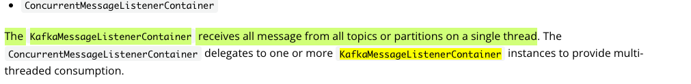

KafkaMessageListenerContainer - читает из всех топиков в один поток

ConcurrentMessageListenerContainer - содержит в себе List<KafkaMessageListenerContainer<K, V>> делегирует им обработку сообщений в многопоточном режиме

обратить внимание на RecordInterceptor и BatchInterceptor!

