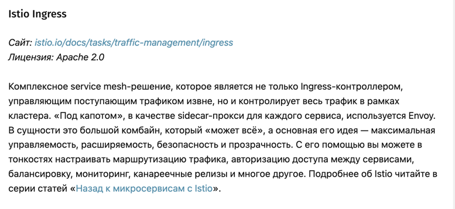
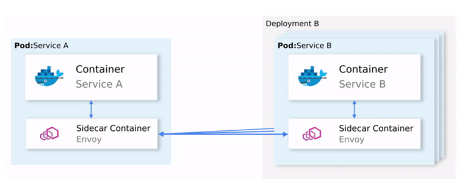

# ISTIO

В новых кластерах используется единый ingress-контроллер от istio на основе Envoy.

**ingress** - это набор правил, который позволяет трафику извне достичь сервисов внутри кластера

**ingress-контроллер** - pod с запущенным контроллером

Две этих сущности друг без друга бесполезны. Работая вместе, Ingress и Ingress-контроллер позволяют создать единую точку входа для трафика и выполняют одновременно роль прокси и балансировщика нагрузки, работая на 7 уровне сетевой модели OSI.

Условно все ingress-контроллеры можно поделить на 2 группы:
1. специфичные приложения, рассчитанные на работу с трафиком каких-либо экосистем.
2. универсальные ingress-контроллеры

## ingress-контроллер от istio

Istio — Open Source-проект, разработанный при сотрудничестве команд из Google, IBM и Lyft. Он решает сложности, возникающие в приложениях, основанных на микросервисах, например, такие как:

- Управление трафиком: таймауты, повторные попытки, балансировка нагрузки
- Безопасность: аутентификация и авторизация конечного пользователя
- Наблюдаемость: трассировка, мониторинг, логирование

Istio  предлагает специализированное решение, полностью отделённое от сервисов и функционирующее путём вмешательства в сетевое взаимодействие. Таким образом оно реализует:

- Отказоустойчивость: опираясь на код статуса в ответе, оно понимает, произошёл ли сбой в запросе, и выполняет его повторно.
- Канареечные выкаты: перенаправляет на новую версию сервиса лишь фиксированное процентом число запросов.
- Мониторинг и метрики: за какое время сервис ответил?
- Трассировка и наблюдаемость: добавляет специальные заголовки в каждый запрос и выполняет их трассировку в кластере.
- Безопасность: извлекает JWT-токен, аутентифицирует и авторизует пользователей.

### Архитектура istio

Istio перехватывает весь сетевой трафик и применяет к нему набор правил, вставляя в каждый pod умный прокси в виде sidecar-контейнера.

### Как это работает у нас

Существует два Istio Gateway:

- Внутренний - для работы во внутренних сетях компании. Используется для публикации приложений, к которым обращаются приложения или пользователи внутри компании.
- Публичный - для работы в Интернете. Используется для публикации приложений, к которым обращаются из внешних сетей/Интернета.

Внутренний istio для балансировки использует envoy.
Istio, который торчит на клиентов, использует api gateway.

Чтобы сконфигурировать api-gateway, необходимо в репозитории https://gitlab.tcsbank.ru/invsre/api-gateway-config прописать, 
как именно должен происходить проброс запросов

Если сервис торчит во внутреннюю сеть, то api-gateway конфигурировать не нужно, достаточно в конфиге сервиса сконфигурировать envoy

