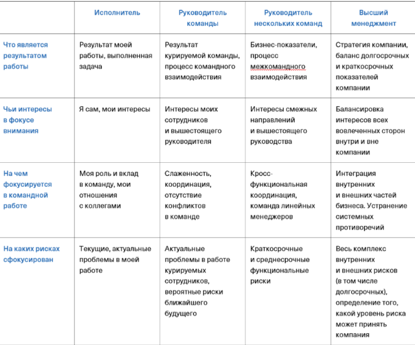
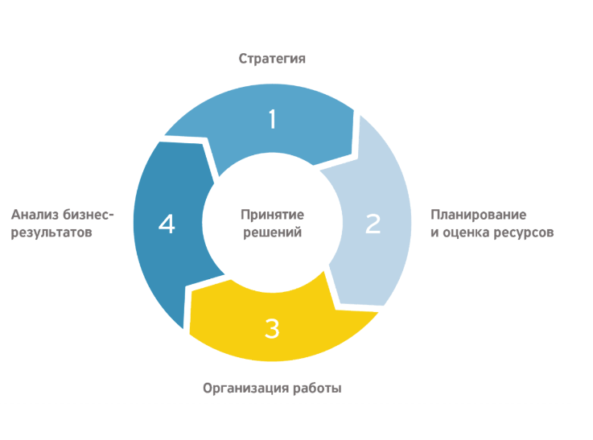
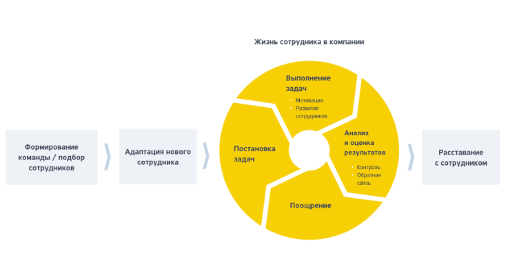
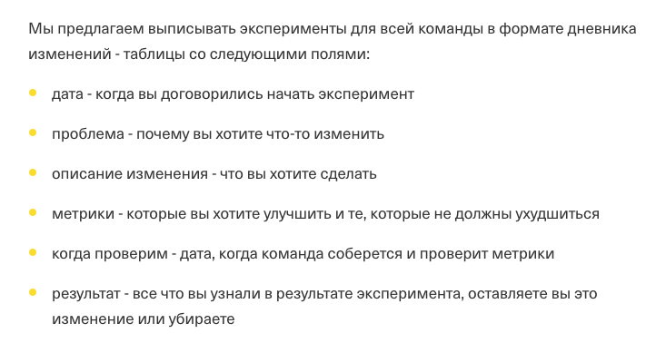
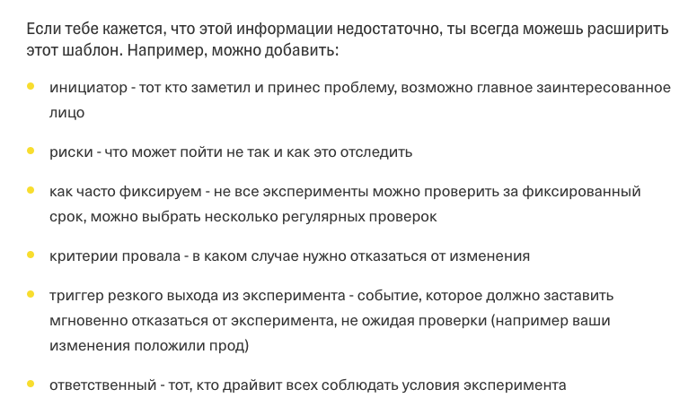

# О роли руководителя

_**Цель руководителя**_ – достижение бизнес-результата руками команды. То есть результатом работы руководителя является результат работы его команды.

Когда сотрудник становится тимлидом, у него меняется восприятие ситуации и то, как он мыслит.

**_Управленческий масштаб_** – это то, как руководитель воспринимает ситуацию вокруг себя, какими категориями мыслит, на чем акцентирует внимание, что считает важным, в какой роли он видит себя по отношению к событиям.

Уровни:
- исполнитель
- руководитель команды
- руководитель нескольких команд(мидл-менеджмент)
- уровень топ-менеджера

Позицию Тимлида можно рассматривать как первую ступень руководителя. 
Как правило, Тимлид занимается распределением нагрузки на команду, следит за ходом развития продукта/системы/сервиса/платформы и берёт на себя ответственность за проект в целом.
При успешном выполнении перечисленных функций Тимлид может продумывать реализацию отдельных задач и писать код.

## Что ты должен делать

1. Стратегия

Руководитель команды формулирует цели для команды: как именно команда будет реализовывать стратегию, как им повышать показатели командной эффективности и т.п.
Доносить и формулировать цели – основная задача руководителя.

   
2. Планирование и оценка ресурсов

Руководитель простраивает путь – то, как мы достигнем цели. Сюда будет входить:

- нарезание задач
- проставление приоритетов
- определение того, сколько задач команда берет в работу
- кто будет этими задачами заниматься
- сколько людей ему можно
- определение сроков и тп

3. Организация работы

Руководитель работает с людьми и обеспечивает непосредственное выполнение задач сотрудником.

4. Анализ бизнес-результатов
Это важная часть цикла, которая позволяет:

- Понять, верно ли выбранное направление или куда двигаться дальше
- Проанализировать, что получилось в результате деятельности команды
- Оценить итоги и принять решение о том, как двигаться дальше

5. Принятие решений

Это ключевая функция руководителя – то, что лежит в основе его деятельности. 
Руководитель – человек, который **принимает решения в рамках своего масштаба и несет за них ответственность**.

## Какими навыками должен обладать тимлид

Тимлид должен уметь организовать работу внутри команды. Любой сотрудник в компании проходит определенный путь, на каждом этапе которого требуется участие руководителя.

Навыки, которыми должен обладать эффективный лидер команды:

- Коучинг
  - конструктивная обратная связь с балансом похвалы и критики
  - регулярные личные встречи
- Умение делегировать
  - людям в команде важно давать решать большие проблемы и расширять зону ответственности
- Вовлеченность в жизнь команды как в работе, так и в их личной жизни
  - не ограничивайте общение с членами своей команды разговорами о работе, интересуйтесь их жизнью
- Продуктивность и нацеленность на результат
  - держите фонус команды на том, что действительно важно
  - помогайте команде расставлять приоритеты
- Навыки коммуникации
  - важно не только говорить, но и слушать
- Стратегическое решение
  - необходимо иметь видение на развитие продукта
- Умение развивать и оценивать сотрудников
  - замечать и измерять результаты работы своих сотрудников
- Техническая экспертиза
  - тимлид должен хорошо понимать предметную область своего проекта

## Ошибки начинающего руководителя

Тимлидом чаще всего становится хороший исполнитель, который все САМ(и то, и то), на него начинают валиться задачи НА КОМАНДУ,
а автоматическая привычка = закрыть самому, отсюла стресс + автоматизированные реакции(сам, сам, сам).

### Неумение делегировать

Важно научиться делегировать - отдавать и распределять задачи по сотрудникам

Делегировать важно потому что:
- можно закопаться в задачах и выгореть
- командой можно сделать гораздо больше
- это развивает и мотивирует сотрудников
- есть возможность заниматься глобальными процессами

Есть области, которые нельзя делегировать:
- мотивация
- контроль
- обратная связь по работе
- увольнение
- конфиденциальные задачи
- **формирование стратегии и цели**

### Непонимание, что происходит в команде

Часто руководители либо закапываются в задачах и просто не успевают взаимодействовать с командой, либо **руководителям бывает неловко занимать лидерскую позицию в отношении своих коллег**.

Общаться и фиксировать договоренности и результаты важно, потому что:

- когда придет время повышать/увольнять сотрудника - нужно уметь обосновать свое решение
- нужно понимать сильные и слабые стороны сотрудников
- сотрудники далеко не всегда рассказывают о своих проблемах/болях
- это демонстрирует сотрудникам твою заботу о них

### Не говорить о проблемах

Как правильно:

1. Доносить до своего руководителя идеи, боли, успехи и ошибки
2. Не бояться просить помощи
3. Менять то, что плохо работает
4. Смотреть на процессы системно

## Инструменты контроля изменений

Во время работы над дневником изменений нужно:
- обсудить, есть ли изменения, которые хочется добавить
- добавить изменение в дневник, если активных изменений не больше N(на которые вы договоритесь с командой)
- пройти по всем активным изменениям и проверить, что метрики собираются
- при достижении контрольных значений метрик или контрольных дат обсудить стоит ли завершить эксперимент успехом или отказаться от него

## Коммуникация с коллегами
### Типы команд

1. Product team - продуктовая команда, непрерывная поставка бизнес-задач
2. Feature team - похожа на product team, занимается организацией автономного процесса разработки подсистемы
3. Project team - выполнение поставленной задачи в конкретные сроки
4. Service team - команды, созданные для того, чтобы упрощать работу продуктовых команд. Заказчиками в данном случае являются продуктовые команды, а не бизнес

### Как построить отношения с коллегами, когда ты стал руководителем

В ситуации перемен люди обычно:
- испытывают тревогу
- нуждаются в поддержке
- проверяют устойчивость границ

2 ошибочных линии поведения, в которые может попасть руководитель:
- у нас ничего не изменилось
  - На самом деле ситуация сильно изменилась. Любая роль несет в себе определенные ожидания к ней и задачи.
  - Если руководитель начинает делать вид, что вовсе он и не руководитель, то КОМАНДУ НАЧИНАЕТ ШТОРМИТЬ. Место руководителя может занять в итоге кто-то другой, кто готов нести отвественность за эту роль.
- контроль и дистанция
  - если скатываться в микроменеджемент, контролировать ситуацию, не разобравшись в ней, можно обидеть сотрудников и тогда они могут потерять самостоятельность

Что же в таком случае делать?

То, что ждет любая команда от своего руководителя — это **устойчивость**.

`Устойчивость = контакт + границы!!!`

#### Что руководителю делать, чтобы обеспечивать команде устойчивость?

- Первое, с чем стоит работать — это с тревогой. Тревога возникает из-за неизвестности и непонимания будущего. Поэтому первое, над чем стоит работать — над структурированием работы, четкостью планов и шагов, которые предстоит сделать.
- Нужно устанавливать контакт и поддерживать его. У сотрудников должна быть уверенность в том, что руководитель их услышит и прислушается к их мнению, поможет и защитит

Все это формирует доверие. Если хочешь, чтобы команда сотрудничала с тобой, начинай сотрудничать с командой.

С опытными сотрудниками у руководителя могут возникнуть проблемы, тк у них есть некоторое недоверие к новому руководителю.
К опытным сотрудникам лучше применять стратегию лидер-лидер. т.е. взаимодействовать с ними из позиции я — лидер (я способен принимать решения) и ты — лидер (ты способен принимать решения), и мы можем друг другу помочь.

`Твоя работа состоит в том, чтобы вести команду к результату. Поэтому ты имеешь право принимать те решения, которые считаешь верными и при необходимости настаивать на них.`

## Hard skills

Каденция – это регулярные события и проверки, приводящие к эволюционным изменениям и эффективному предоставлению сервиса. 
Термин каденция может означать временной период между проверками/встречами. Каденция = циклы обратной связи. Суть одна и та же, термины взаимозаменяемые.

Можно выделить 4 основные каденции для команд, каждая из которых направлена на свой аспект работы:
- собрание по пополнению (планирование)
- дейли/канбан-митинги
- ретро
- 1-to-1

**Собрание по пополнению** - задача для помещения рабочих элементов в систему. На этой встрече необходимо ответить на следующие вопросы:
- Готова ли задача к работе?
- Какие задачи команда возьмет в работу?
- В каком порядке команда будет брать задачи?

В зависимости от контекста во встрече могут участвовать только тимлид + продакт/менеджер, так и вся команда

Встреча носит обязательный характер, потому что **на ней задачи пересекают точку принятия обязательств** и начинает тикать счетчик LT (lead time).

