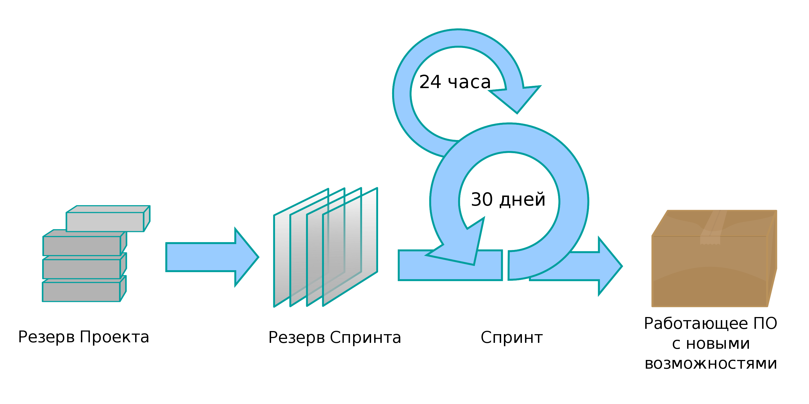

# SCRUM

Scrum - это методология, которая помогает людям и организациям управлять проектами.

## Определения

_Спринт_ - промежуток времени, достаточный для выполнения запланированной совокупности операций Scrum, целью которой является создание инкремента бизнес-продукта. Жёстко фиксирован по времени. Длительность одного спринта от 1 до 4 недель. Чем короче спринт, тем более гибким является процесс разработки, релизы выходят чаще, быстрее поступают отзывы от потребителя, меньше времени тратится на работу в неправильном направлении, но много времени тратится на митинги планирования спринта, ретроспективы.

## Артефакты Scrum

Диаграмма сгорания задач (Burndown chart) - Диаграмма, демонстрирующая количество сделанной и оставшейся работы относительно времени на разработку проекта называется диаграммой сгорания. Данные диаграммы необходимо ежедневно обновлять, чтобы в реальном времени показывать подвижки и издержки в работе над спринтом и проектом, доступные для всех членов Scrum-команды: скрам-мастера и владельца продукта.
Диаграмма сгорания работ для спринта — показывает сколько задач сделано и сколько ещё остаётся сделать в текущем спринте.

