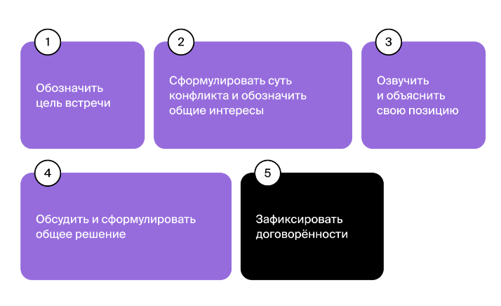

В наставничестве обратная связь может решать разные задачи, но самая важная — корректировка поведения падавана.

Чтобы обратная связь была внятной и экологичной, стоит придерживаться простой структуры: действие — результат — влияние — договорённость.

Важно:
- не говорить о личностных качествах человека
- говорить о действиях
- избегать предположений
- давать связь наедине
- давать связь сразу
- соблюдать баланс похвалы и замечаний

##Про конфликты

Плохо организованный доступ к дефицитному ресурсу — только одна из возможных ошибок в дизайне процессов. К конфликтам приводят дублирование обязанностей, отсутствие ответственного, непрозрачность принятия решений, противоречащие цели разных сотрудников.
Чтобы избежать подобных проблем, на этапе формирования команды тимлиду важно уделить особенное внимание дизайну рабочих процессов. 

Вполне возможно, что культура общения, принятая в команде, является токсичной. 
Если переходить на личности и нападать друг на друга — норма, то конфликты будут разгораться быстро и часто. Даже в тех случаях, когда ситуация не так остра.

Открытый конфликт — это некомфортная ситуация. Приходится озвучивать и обсуждать сложные вопросы, иногда — принимать тяжёлые решения. К тому же конфликтам часто сопутствуют сильные эмоции. 

У любого конфликта есть полезная функция: **он помогает обнаружить проблему**. Она может быть в коммуникации, соблюдении интересов, организации процессов и культуре.

Вторая полезная функция конфликта — это **подталкивание к поиску лучшего решения**. Обычно, чтобы разрешить конфликт, сторонам приходится внимательно прислушаться друг к другу, учесть все аргументы и сбалансировать интересы. Это помогает всем вовлечённым лучше понять проблемную ситуацию и найти оптимальное решение.

**В неконструктивном конфликте стороны сфокусированы на собственных целях и интересах** и играют в игру с нулевой суммой. То есть хотят отстоять свою позицию за счёт поражения позиции другого.

###Как вести себя, если вы сторона конфликта

####Первый шаг к решению конфликта — подготовка

На встречу необязательно приходить с готовым решением, но сформулированные аргументы и позиция помогут.
Невозможно заранее предугадать, что именно окажется важным для другого участника конфликта, поэтому лучше быть готовым слушать и проявлять гибкость при поиске решения. 
При этом важно чётко понимать как свои интересы, так и аргументы, которые будут убедительны для собеседника. Их стоит продумать заранее.

Тому, кто испытал сильные эмоции, полезно заранее подумать, как их описать, и сформулировать, какие именно действия их вызвали. 
А собеседнику нужно быть готовым выслушать, проявить эмпатию и, возможно, объяснить своё поведение.

####Алгоритм решения конфликта

Подготовленная встреча может превратиться в непродуктивный обмен мнениями, если у неё нет понятного плана. Чтобы не упустить ничего важного и прийти к полезному итогу, можно следовать следующему алгоритму.

###Как понять, что нужна медиация конфликта, и как её провести

####Когда не нужно вмешиваться в конфликт

Если люди умеют общаться экологично и договариваться, то они справятся с ситуацией сами. Если коллеги или члены вашей команды спорят по рабочим вопросам, но на их отношениях, атмосфере в команде и общей продуктивности это не сказывается, можно не вмешиваться.

####Когда медиация нужна

- **В конфликте появились элементы токсичной коммуникации**. 
  Тимлиду или наставнику стоит вмешаться в конфликт, если у сотрудников не получается конструктивно обсуждать рабочие вопросы и вместо этого они переходят к ругани, используют пассивную и активную агрессию.
- На фоне конфликта между сотрудниками снизилась общая продуктивность и страдает атмосфера в команде
- Одному из членов спора сложно отстоять свою позицию. Некоторым сотрудникам сложно отстаивать свою позицию в споре. Это происходит по разным причинам: человек может быть неконфликтным или неуверенным в себе, а может быть, он видит формальный перевес у второй стороны в силу опыта, возраста или позиции.
**Если не распознать скрытое противостояние и не вмешаться, мотивация сотрудника будет постепенно угасать**. Так можно потерять ценные идеи, а иногда — талантливого специалиста.
- Конфликт между сотрудниками регулярно становится помехой в общем принятии решений. Иногда разногласия между сотрудниками выходят за пределы их рабочего взаимодействия и могут парализовать принятие командных решений. Это тоже сигнал к тому, что пора действовать.

####Как провести медиацию

Если вы выступаете посредником в конфликте, полезно провести собственные наблюдения: поговорить с участниками столкновения, изучить причины проблемы и опросить коллег. 

После подготовки можно назначить встречу и вместе с участниками конфликта пройти по уже знакомому алгоритму
- Зафиксировать цель встречи.
- Помочь сторонам сформулировать суть конфликта и обозначить общий интерес.
- Обсудить позиции сторон.
- Сформулировать совместное решение.
- Зафиксировать договорённости.
- Договориться о мониторинге.

####Что делать, если конфликт не удаётся решить

Причина 1. Участники затянули с обсуждением накопившихся противоречий и уже не готовы к конструктивному диалогу. Для них конфликт из рабочего превратился в личный.

Причина 2. Стороны не в первый раз входят в похожий конфликт. Уже были попытки договориться, и это не сработало.

Причина 3. Противоречия между участниками принципиальны: они столкнулись на уровне ценностей или взглядов на мир. 

**Если не получается решить конфликт, надо ограничить взаимодействие между его участниками**

Если перераспределить обязанности и уменьшить взаимодействие между конфликтующими сотрудниками нельзя, то стоит подумать о переводе одного из них в другую команду или об увольнении.
Может оказаться, что напряжённые отношения между разработчиками стоят команде слишком дорого. Например, из-за них проект движется медленно, а участники команды устали от постоянной ругани и демотивированы. В этом случае перевод или увольнение будет сложным, но оправданным решением.

Если вы умеете вовремя обнаруживать и эффективно разрешать противоречия (и как сторона конфликта, и как посредник), ваша ценность для команды и работодателя выше. Развивать этот навык можно, взяв на себя роль наставника. 

